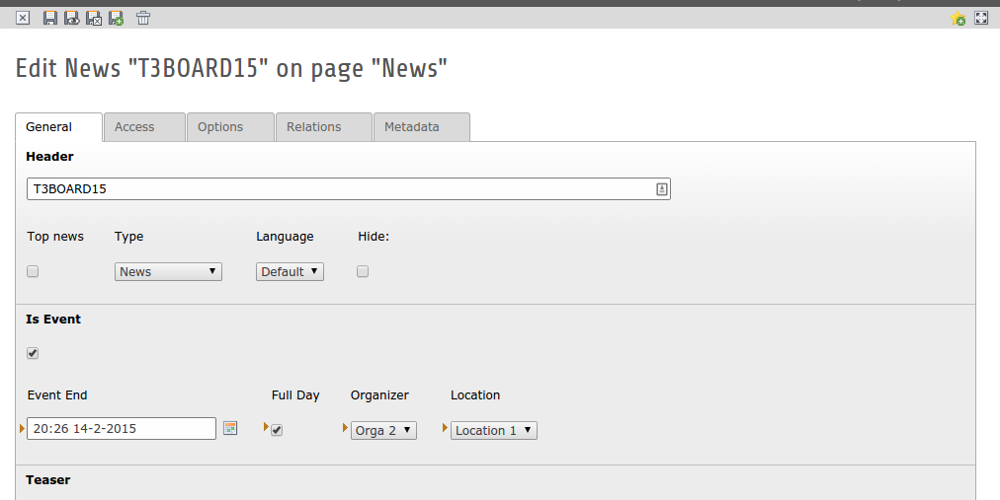

.. ==================================================
.. FOR YOUR INFORMATION
.. --------------------------------------------------
.. -*- coding: utf-8 -*- with BOM.

.. include:: ../Includes.txt

.. _introduction:

Introduction
============

.. _what-it-does:

What does it do?
----------------

This extension extends "news" (http://typo3.org/extensions/repository/view/news) with additional event functionality.
This includes additional fields and an extra view to display a calendar.

.. _requirements:

Requirements
------------

The requirements for this extension are:

- EXT:news 3.1.0+
- TYPO3 CMS 7.6 LTS

.. _screenshots:

Screenshots
-----------

Here you can see a few examples what you can achieve with "event news".

	Additional fields in the news record

.. figure:: ../Images/WhatDoesItDo/UnstyledFrontend.png
	:alt: Unstyled frontend

	Unstyled frontend
